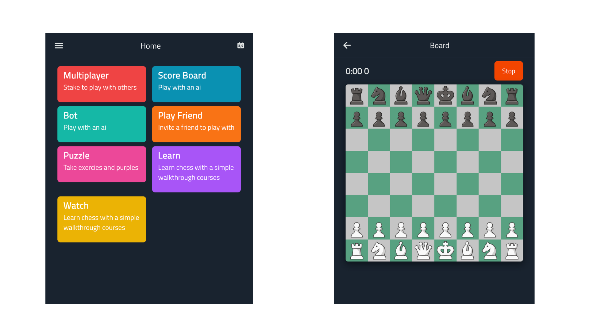

# Board Masters
This is a simple multiplayer chess game. We aim the solve the challenges of participating in 
various chess tournament and also provide a platform where friends can come together and play 
games.

## Features and Roadmap
    [] Multiplayer
    [] Stake matches using cryptocurrencies
    [] Invite friends
    [] Play with AI

## Structure of Repository

This project uses Turbo-repo for management of the various apps and packages. 
- Apps
  - mini: which is also the frontend application. 
  - ws: websocket server running on socket.io
  - server: http server for handling non-websocket request to the backend
- Packages
  - rpc: where the core backend logic takes place. 
    - service: core logic of the app
    - rpc: exposes endpoints to the frontend
    - repository layer: communicates with the database
  - ui: major frontend reusable components
  - eslint
  - tailwind-config
  - typescript-config
- Foundary
  - The smart contract

## Technology used
Frontend: Next.js, Tailwind, Wagmi, Ethers.js, Socket.io-client, WalletConnect
Backend: Express.js, Hono.js, Socket.io, Ethers.js
Smart Contract: Foundary

#### Run locally
- Clone the repository from github
- cd in the folder
- Run `pnpm install` to install all packages
- Run `pnpm run dev:mini` to run the frontend server
- Run `pnpm run dev:server` to run the backend Hono.js server
- Run `pnpm run dev:ws` to run the websocket server

## Links
- [Live Demo](https://www.youtube.com/)
- [Video Walk through](https://www.youtube.com/)
- [Github](https://github.com/Philix27/Board-Masters)

## Roadmap

- [] Basic chess logic
- [] Use of Socket.io for multiplayer 
- [] Use of XMTP for in app messaging during chat
- [] Create rooms for managing various games
- [] Use of Web3Auth for Authentication of user on the web
